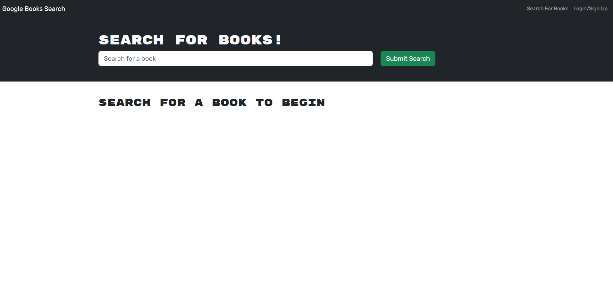

# Book Search Engine

This is a full-stack social media web application built with MongoDB, Mongoose, Express, React, Apollo, and Moment.js for date formatting. It allows users to create, read, update, and delete social media posts. It also provides user authentication and comment functionality.

## Description

This application provides a book search engine. When the user loads the search engine, they are presented with a menu with the options to search for books and login/signup, an input field to search for books, and a submit button. The user can search for books, see their saved books, and logout. The user can also signup and login. When a book is saved, the book's information is saved to the user's account. The user can also remove a book from their saved books list.

## Table of Contents

- [Installation](#installation)
- [Usage](#usage)
- [Link to Deployed Application](#link-to-deployed-application)
- [License](#license)
- [Contributing](#contributing)
- [Questions](#questions)
- [Technologies Used](#technologies-used)

## Installation

To set up the Social Media WebApp on your local machine, follow these steps:

1. Clone the project repository to your local storage:

```
git clone
```

2. Open your terminal and navigate to the cloned project directory:

```
cd book-se
```

3. Install the required dependencies:

```
npm install
```

4. Set up the MongoDB database:

5. Start the application:

```
npm start
```

6. Access the application in your web browser at http://localhost:3001 for local environment.

## Usage

This application is a book search engine that allows users to search for books and manage their own book collections. Here's how to use it:

1. **Load the Search Engine:**

   When you load the search engine, you will be presented with a menu with the options to "Search for Books" and "Login/Signup". There is also an input field to search for books and a submit button.

2. **Search for Books:**

   Click on the "Search for Books" menu option. You will be presented with an input field to search for books and a submit button. Enter a search term in the input field and click the submit button. You will be presented with several search results, each featuring a book’s title, author, description, image, and a link to that book on the Google Books site.

3. **Login/Signup:**

   Click on the "Login/Signup" menu option. A modal will appear on the screen with a toggle between the option to log in or sign up.

   - **Signup:** If the toggle is set to Signup, you will be presented with three inputs for a username, an email address, and a password, and a signup button. Enter a valid email address and create a password, then click on the signup button. Your user account will be created and you will be logged in to the site.

   - **Login:** If the toggle is set to Login, you will be presented with two inputs for an email address and a password and a login button. Enter your account’s email address and password, then click on the login button. The modal will close and you will be logged in to the site.

4. **Logged In:**

   When you are logged in to the site, the menu options change to "Search for Books", an option to see your saved books, and "Logout". You can enter a search term in the input field and click the submit button to search for books. The search results will include a button to save a book to your account.

5. **Save a Book:**

   Click on the "Save" button on a book to save that book’s information to your account.

6. **View Saved Books:**

   Click on the option to see your saved books. You will be presented with all of the books you have saved to your account, each featuring the book’s title, author, description, image, and a link to that book on the Google Books site and a button to remove a book from your account.

7. **Remove a Book:**

   Click on the "Remove" button on a book to delete that book from your saved books list.

8. **Logout:**

   Click on the "Logout" button to log out of the site. You will be presented with a menu with the options "Search for Books" and "Login/Signup" and an input field to search for books and a submit button.

## Link to Deployed Application

[Link to WalkThrough Video](https://book-se-graphqlmigration.onrender.com/)


## License

This project is licensed under the MIT license.

## Contributing

Please feel free to submit pull requests or open issues to improve the application functionality.

## Questions

For any questions, please contact the project owner.

## Technologies Used

### The application is built with the following technologies:

#### Backend:

Apollo Server
Bcrypt
Dotenv
Express
GraphQL
JWT
Mongoose
Nodemon

#### Frontend:

Apollo Client
Bootstrap
Dotenv
GraphQL
JWT
React
React Bootstrap
Vite
ESLint

The application also uses concurrently for running multiple npm scripts concurrently.
